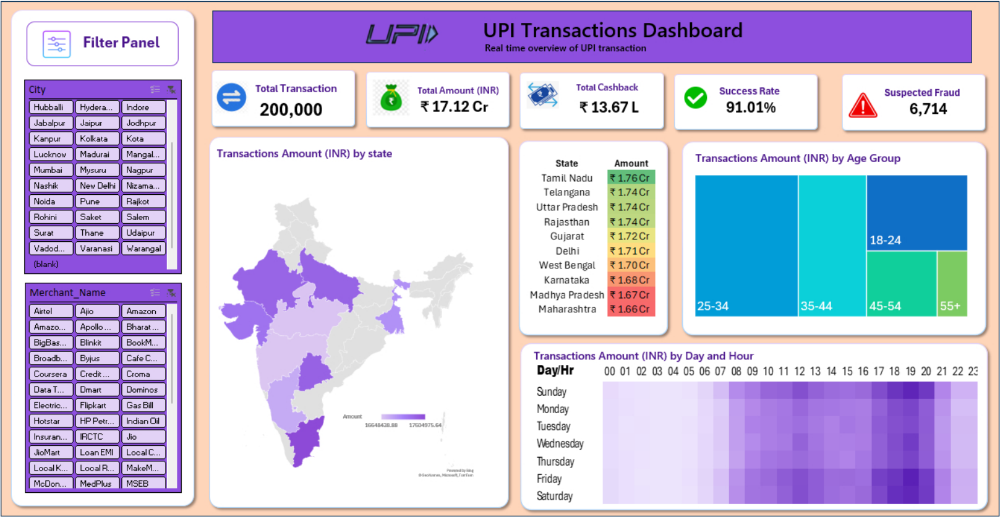
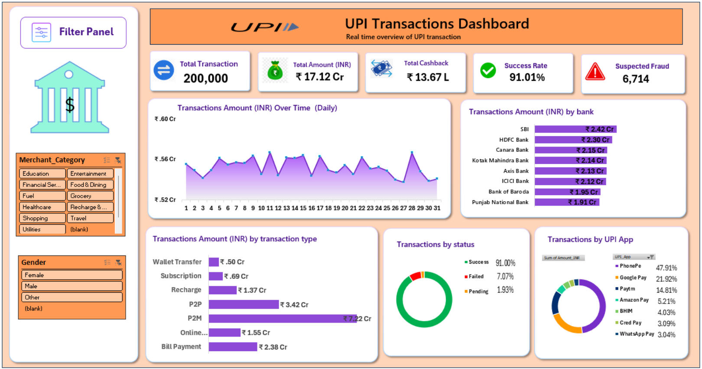

# UPI Transaction Analytics Dashboard | Microsoft Excel 

An interactive **UPI Transaction Analytics Dashboard built using Microsoft Excel** to analyze **200,000 sample UPI transactions from May 2026**  Using PivotTables, slicers, KPIs, and data visualizations to analyze transaction trends, banking, customer segments, payment apps, and transaction performance.

## Project Overview

This project analyzes UPI transaction data across multiple dimensions including:

* State and city
* Age group
* Gender
* Banks
* Transaction types
* UPI applications
* Transaction status
* Day and hour
* Suspected fraud indicators

The project contains two interactive Excel dashboard pages supported by PivotTables, calculations and slicers.

> **Note:** This is a portfolio/learning project based on a sample dataset and is not connected to a live UPI transaction system.

## Objectives

* Analyze overall UPI transaction performance
* Identify high-value states and banks
* Analyze transaction types and UPI applications
* Understand demographic transaction patterns
* Examine transaction success and failure
* Analyze transaction amount by day and hour
* Monitor suspected transaction indicators
* Present findings through interactive Excel dashboards

## Dataset

* **Records:** 200,000 transactions
* **Period:** May 1–31, 2026
* **Format:** Excel
* **Source:** Sample UPI transaction dataset used as part of a publicly available YouTube tutorial

## Tools Used

* Microsoft Excel
* PivotTables
* Excel calculations
* Slicers
* Excel charts
* Map visualization
* Treemap
* Heatmap
* KPI cards

## Data Preparation

The source dataset was already cleaned.

The main preparation performed for this project included:

* Creating `Day`
* Creating `Hour`
* Organizing data for PivotTable analysis
* Performing KPI calculations
* Converting large transaction values into Crore/Lakh presentation formats

## Key KPIs

| KPI                    |     Value |
| ---------------------- | --------: |
| Total Transactions     |   200,000 |
| Total Amount           | ₹17.12 Cr |
| Total Cashback         |  ₹13.67 L |
| Success Rate           |    91.01% |
| Suspected Transactions |     6,714 |

## Dashboard 1

### Geographic, Demographic & Time Analysis

The first dashboard analyzes:

* Transaction amount by state
* Age-group transaction amount
* Day/hour transaction patterns
* State ranking
* City filtering
* Merchant filtering

**Dashboard preview:**


## Dashboard 2

### Banking, Transaction & Payment Analysis

The second dashboard analyzes:

* Daily transaction amount
* Bank-wise transaction amount
* Transaction type
* Transaction status
* UPI application contribution
* Merchant category filtering
* Gender filtering

**Dashboard preview:**

## Key Insights

* Tamil Nadu has the highest displayed state-wise transaction amount at approximately ₹1.76 Cr.
* SBI has the highest displayed bank-wise transaction amount at approximately ₹2.42 Cr.
* P2M has the highest displayed transaction-type amount at approximately ₹7.22 Cr.
* PhonePe has the largest UPI application share by transaction amount at 47.91%.
* Successful transactions account for approximately 91% of transaction records.
* 6,714 transactions are marked as suspected using the existing `Is_Suspected` field.
* The 25–34 age group represents the largest displayed age-group segment by transaction amount.

## 📸 Dashboard Preview

[](screenshots/dashboard_1.png)

[](screenshots/dashboard_2.png)


## Project Structure

```text
UPI-Transaction-Analytics-EXCEL/
│
├── README.md
├── LICENSE
├── UPI_Transaction_Analytics.xlsx
└── Dashboard_img.pdf
│

└── screenshots/
    ├── dashboard1.png
    └── dashboard2.png
|
└── Report.pdf
UPI_Transaction_Analytics.xlsx
│
├── Raw Data
├── Prepared Data
├── Calculation
├── Dashboard 1
└── Dashboard 2
```

## Future Scope

* Automated data refresh
* Machine-learning-based fraud detection
* Transaction forecasting
* Customer segmentation
* Advanced failure analysis
* Power BI implementation
* Real-time data integration

## Disclaimer

This project uses a sample UPI transaction dataset for educational and portfolio purposes. The dashboard does not represent live UPI transaction data, and suspected transactions should not be interpreted as confirmed fraud.


## How to Use

1. Download `UPI_Transaction_Analytics.xlsx` from this repository.
2. Open the workbook using **Microsoft Excel**.
3. Start with the `Dashboard 1` and `Dashboard 2` sheets to explore the analysis.
4. Use the available **slicers** to filter the dashboards by City, Merchant, Merchant Category and Gender.
5. To understand how the analysis was created, explore the `Raw Data`, `Prepared Data` and `Calculations` sheets.
6. PivotTables can be refreshed in Excel if the underlying data is modified.

### Recommended Excel Version

For the best experience, use a recent version of **Microsoft Excel** that supports PivotTables, slicers and the dashboard visualizations used in this project.

## Author

**Sidhant Kumar**

Data Analytics | Excel | SQL | Power BI | Python
BSc Computer Science and Data Analytics
IIT Patna